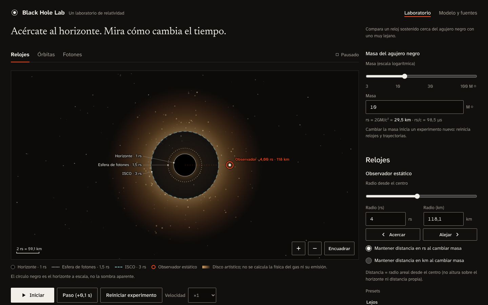

# Black Hole Lab

Un laboratorio interactivo de relatividad: arrastra un observador hacia un agujero negro de Schwarzschild y compara su reloj con uno lejano, lanza partículas con física newtoniana y relativista sobre el mismo tiempo coordenado, y dispara fotones que se capturan o se dispersan según su parámetro de impacto. Es una web estática, sin backend, en español.



## Diseño

Interfaz en el lenguaje visual Yev Design v0.2 (dialecto de aplicación; `/about` en dialecto de lectura): tinta cálida y papel, Yev Signal `#FF4D1F` reservado para el observador y la ubicación actual, colores de datos separados de la marca, rejilla asimétrica 9/3, geometría rectilínea y agrupación por espacio. Tipografías Atkinson Hyperlegible Next, Newsreader y Atkinson Hyperlegible Mono, autoalojadas con Fontsource (OFL-1.1). Detalle en [docs/14-decisions.md](docs/14-decisions.md) (D26).

## Arrancar

Requisitos: Node 24 LTS (probado con 24.21.0; `engines` exige ≥ 22.17 por SvelteKit 3) y npm 11.

```bash
npm ci
npm run dev          # http://localhost:5173
```

Build estático y prueba local:

```bash
npm run build        # genera build/ (index.html, about.html, _app/…)
npm run preview      # sirve build/ en http://localhost:4173
```

`build/` se puede publicar en cualquier hosting estático (no hay que configurar rewrites: todas las rutas se prerenderizan). No se ha desplegado nada.

## Scripts

| Script | Qué hace |
| --- | --- |
| `dev` | Servidor de desarrollo de Vite |
| `build` | Compilación de producción con adapter-static → `build/` |
| `preview` | Sirve el build en el puerto 4173 |
| `check` | `svelte-kit sync` + `svelte-check` (falla también con avisos) |
| `lint` | Prettier en modo comprobación + ESLint |
| `format` | Prettier con escritura |
| `test:unit` | Vitest en modo run |
| `test:e2e` | Playwright (Chromium) contra build + preview |
| `test` | Alias de `test:unit` |
| `verify` | check → lint → test:unit → build; se detiene en el primer fallo |

Para E2E en una máquina nueva: `npx playwright install chromium`.

## Qué incluye

**Relojes.** Masa 3–100 M☉ (slider logarítmico y campo), observador en 1,01–20 rs con slider, campos rs/km sincronizados, botones Acercar/Alejar, drag sobre la escena con captura de puntero y teclado (flechas, Mayús, Inicio/Fin). Dos relojes acumulativos con escala didáctica, razón q = √(1 − 1/x) y su inversa, comparación de 60 s, aceleración propia necesaria y aviso cerca del horizonte. Lock rs/km al cambiar masa (en km se rechaza un cambio que deje al observador fuera de dominio, con acción explícita para volver a rs).

**Órbitas.** Modelos Newton, Schwarzschild y Comparar (mismo evento y mismas derivadas espaciales respecto a T; animación sobre la misma T). Condiciones iniciales por velocidad local β y dirección α, con campos o arrastrando la flecha en la escena tras «Preparar lanzamiento». Órbita circular con estabilidad correcta (estable > 3 rs, marginal en 3, inestable entre 1,5 y 3, inexistente ≤ 1,5). Tabla de cuerpos con estado, tiempo propio (solo masivas Schwarzschild), rapidez local o coordenada y residual; diagnóstico con E, ℓ, pasos y periastros. Límite de 8 lanzamientos con opción de eliminar el más antiguo.

**Fotones.** Emisor finito (12 rs por defecto, 6–20 avanzado), |B| en [0, 5] con lado del rayo, ángulo local derivado, trayectoria prevista en pausa recalculada al cambiar B, emisión de hasta 12 fotones, aviso cerca de Bcrit. Sin tiempo propio.

**Comunes.** Iniciar/Pausar, Paso (0,1 s o 0,1 T), Reiniciar experimento, velocidad ×0,25–×4, Valores iniciales; zoom 0,5–2 (botones, o rueda con la escena enfocada), Encuadrar e indicador de observador fuera de campo; capas (disco, malla, referencias, trazas, etiquetas) y calidad; presets deterministas; copiar enlace (`#scenario=…`, con alternativa manual), exportar/importar JSON, exportar PNG con leyenda y contexto; persistencia local con debounce; pausa al ocultar la pestaña; movimiento reducido; tutorial omitible; página [Modelo y fuentes](src/routes/about/+page.svelte).

## Modelo físico y límites

- Un único agujero negro de Schwarzschild, masa fija por experimento, partículas de prueba en el plano ecuatorial. Ecuaciones normativas en [docs/04-physics.md](docs/04-physics.md).
- Geodésicas exactas integradas con RK4 adaptativo (step doubling, atol 1e−9, rtol 1e−8) en λ acumulando T. Newton con velocity Verlet (h = 0,01 T). Ambos precalculados en fragmentos cancelables de ~4 ms e interpolados en una T común.
- La captura se detiene en el cutoff numérico x = 1,01 (no redefine el horizonte). Escape solo se declara con un criterio de energía/potencial que garantiza que no hay retorno; salir del área visible se muestra como «Fuera del área». Límites de cálculo (T máx. 2000 masivas / 400 fotones, pasos, evaluaciones, 4 s de cálculo) marcan la trayectoria como parcial.
- Distancias = radio areal. La vista es geométrica a escala, no una imagen óptica: el círculo negro es el horizonte, no la sombra. Disco, malla, halo y estrellas son ilustraciones etiquetadas.
- Fuera de alcance: Kerr, óptica de imagen, 3D, hidrodinámica, espectros, interior del horizonte.

## Arquitectura

```text
src/lib/physics/      fórmulas puras (sin DOM, Svelte, Date ni performance)
src/lib/simulation/   integradores RK4/Verlet, trayectorias, jobs cancelables, motor (un único RAF)
src/lib/rendering/    cámara (inversa exacta), dibujo Canvas 2D por capas, exportación PNG
src/lib/scenarios/    ScenarioV1, validación estricta, presets, URL, localStorage, JSON
src/lib/state/        LabState (runes) por instancia; vista de escena por frame
src/lib/components/   UI accesible (Svelte 5)
src/routes/           / y /about, prerenderizadas con SSR del shell
tests/unit/           física, integración, motor, escenarios, contraste
tests/e2e/            flujos de usuario en Chromium
```

Los imports internos usan los subpath imports de SvelteKit 3 (`#lib/...`, con extensión `.ts`).

## Escenarios y privacidad

Solo se guardan condiciones iniciales y preferencias de vista (`black-hole-lab:scenario:v1` en localStorage, con debounce de 300 ms). Prioridad al cargar: enlace válido → escenario local válido → valores iniciales; un enlace inválido avisa y usa valores iniciales. Importar, cargar un preset o un enlace deja siempre la simulación en pausa y reiniciada. Sin cookies, telemetría ni servidor.

## Pruebas y evidencia

Resultados reales, comandos y entorno en [docs/PROGRESS.md](docs/PROGRESS.md). Capturas en [docs/screenshots/](docs/screenshots/).

## Encargo y prompts

Este repositorio nació de un kit de especificación que se conserva:

- [CLAUDE.md](CLAUDE.md), [TASKS.md](TASKS.md) y [docs/](docs/) (producto, diseño, física, integración, contratos, pruebas, aceptación, decisiones y fuentes).
- [reference/](reference/): oráculo numérico independiente en Python (`python3 reference/generate_reference.py --check`).
- [prompts/01-build.md](prompts/01-build.md), [prompts/02-resume.md](prompts/02-resume.md), [prompts/03-audit.md](prompts/03-audit.md).

## Licencia

Ver [LICENSE](LICENSE). Todos los gráficos son propios (CSS, SVG y Canvas). Las fuentes (Atkinson Hyperlegible Next/Mono y Newsreader, SIL OFL-1.1) se empaquetan localmente desde Fontsource; no hay assets ni fuentes remotas.
